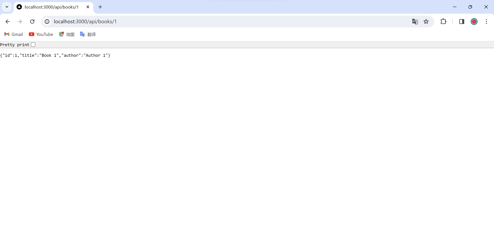

# docker-challenge-template
## Materials
- GitHub desktop
- Docker desktop
- Forked GitHub repository
- Challenge2.zip
- IDE(vs code)
## Challenge 1 – Setting up an HTML Server
### Step 1
- Clone the forked GitHub repository to local machine
### Step 2
- Add a `public` folder under `challenge1` folder
### Step 3
- Add a file with name `index.html`. It should contain your name and student ID number.
### Step 4
- Create a Dockerfile to use NGinx to serve pages existent on the public folder

### Step 5
- Run cmd, use following command lines
  - To build Docker image
`docker build -t my-nginx-image:latest .`
  - To run Docker container
`docker run --name my-nginx-container -d -p 8080:80 my-nginx-image:latest`

### Step 6
- Go to `http://localhost:8080` or Docker desktop -> container and click on port link

Then check the page

## Challenge 2 - Setting up a NodeJS Server
- Unzip challenge2.zip to get three files, and add these three files to `challenge2` folder
- Create a Dockerfile in challenge2 folder to build the server’s Docker container

- Create the Docker compose file using NGinx and the API server from previous step
  - I used ports: - “8080:8080” at first but there was an error
  
  - Then I changed it to 3000
  
- Run the following command lines

- Open challenge2 container in Docker desktop and click on the second link

- Navigate to api/books and api/books/1

### Reference
- https://github.com/eduluz1976/dockerchallenge-template.
- https://www.docker.com/products/docker-desktop/
- https://www.freecodecamp.org/news/the-docker-handbook/
## Challenge 3 – Full stack application
### Step 1
- Download `challenge3.zip`
- Add all files present on challenge3.zip to the challenge’s root folder.
### Step 2
- Create the .env file with the appropriate values in the `challenge3and4` folder(refers to the screenshot below)

 
### Step 3
- Create the docker-compose.yml with all 3 services in the `challenge3and4` folder(refers to the screenshot below):
  - nginx
  - node-service
  - db
 
### Step 4
- Open the terminal and run the following commands.  
` docker build -t node-service -f .\docker\api\Dockerfile . `
` docker build -t db -f .\docker\db\Dockerfile . `
` docker build -t nginx . `
` docker-compose up -d `
### Step 5
- Verify if all services are running properly.
  - Open a browser and point it to the address `http://localhost:8080/api/books`
    you should see something like:
      
  - `http://localhost:8080/api/books/1`
      
  - executing the command ` docker-compose ps `
    you should see something like:
      
## Challenge 4 – Scaling up an application
### Step 1
- Use the application from challenge3
### Step 2
- Open a browser and point it to the address ` http://localhost:8080/api/stats `
- Record the field “hostname” 
- Repeat the same operation a couple of times. Before you scale up your node service, you
should always see the same hostname after repeated requests.
  
  
### Step 3
- Scale up a particular service.
  - Perform it on “node-service”, scaling up from 1 to 3    instances.
    Use this command line ` docker-compose up --scale node-service=3 -d `
- Now repeat the operation, performing requests to your application on `http://localhost:8080/api/stats` multiple times, recording the hostname.
  - After scaling up your node service, you should note that now each request will bring a different hostname
### Reference
- https://www.youtube.com/watch?v=1je3VxDF67o
- https://docs.docker.com/compose/environment-variables/
- https://docs.docker.com/reference/cli/docker/compose/up/
- https://www.appsdeveloperblog.com/scaling-with-docker-compose-a-beginners-guide/

